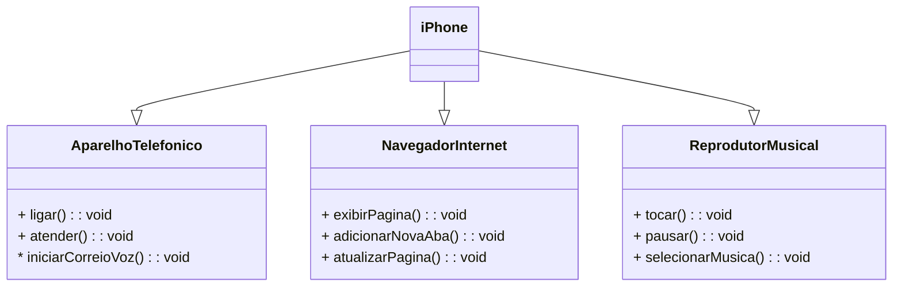

## Projeto "Diagramação de Classes do iPhone"

Este projeto foi realizado durante o Santander Bootcamp 2023 - FullStack Angular + Java.

Foi utilizado o site [draw.io](app.diagrams.net) para a criação de um diagrama UML representando as classes do iPhone e todo o código foi construído usando a linguagem Java.

## Diagrama - iPhone

